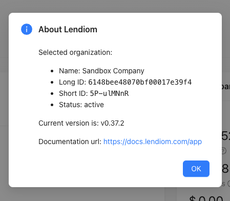

## Terminology

#### What is an Organization?
An organization represents a business.

## How do I check the version of Lendiom I am using? {#check-version}
You can check the version of Lendiom you are using by clicking on your name, then clicking on "About". You will see the following screen:

