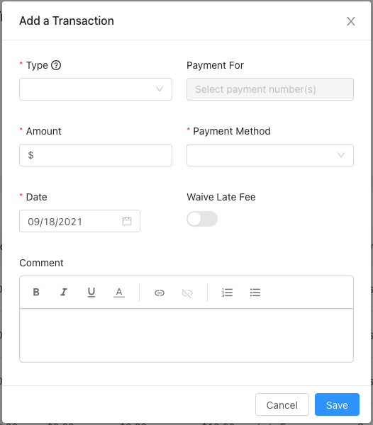
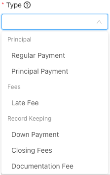

A transaction in the Lendiom system represents any time there is an exchange of money. For example, a down payment is paid or a regular payment is made.

## New Transaction Screen

Below is a screenshot of the screen where you enter in the details of a new transaction.

## Input Descriptions
Generally, once a transaction is created none of the values can be changed, however, there are three exceptions. The first exception is that you can change the status. The second exception is that you can reverse a transaction, which is an "undo" for a transaction. The third exception is that you can change the date of a transaction, however, it won't affect the amortization and is only a change of the date.

### Transaction Type {#input-type}
The transaction type determines how the money is applied against the loan. For a detailed description of what each type is, please see the [Transaction Application Flow](#transaction-flow) section below.

### Payment For {#input-payment-for}
When the [Transaction Type](#input-type) is a [Regular Payment](#type-regular), this input is enabled. One or more payments can be selected. Payments which have been paid in full will not appear. The payments which have an asterisk `*` in front of them are late.

:::caution Work in Progress

The **Payment For** section is in progress. If you have any questions, please send them to us so we can add here to clarify.

:::

### Amount {#input-amount}
The amount of money in the transaction. Whenever any number of payments are selected, this input will be populated with the sum total of the payments.

### Payment Method {#input-payment-method}
The way in which the money was exchanged. The current options are:

* Banking
  * Credit/Debit Card
  * Cash
  * Check
  * Bank Transfer (ACH)
  * Wire
  * Money Order
  * Cashier's Check
  * Zelle
* Apps
  * Cash App
  * PayPal
  * Venmo
* Other
  * Barter (exchange of service for payment, etc)
  * Other

### Date {#input-date}
When the transaction happened.

:::note

Transactions must be applied in sequential order (oldest to newest).

:::

### Waive Late Fee {#input-waive-late-fee}
If the date of the transaction is after the due date of a selected payment, this input will be enabled. Waiving the late fee will reverse an late fee which has been applied automatically.

### Status {#input-status}
Whenever the [Transaction Type](#input-type) is **Regular Payment**, a *Status* input will show up. This allows you to set a transaction as any of the following:
* Pending
* Success
* Failure
* Reversed

:::tip

One great use case of the Status field is whenever someone makes a payment that will take a few days for the money to clear.

**An example:** A buyer sends you a check or money order and you deposit it into the bank. That check or money order then takes a few days to clear and the money be available in your bank account.
Create the transaction with the date the check/money order was received and then change the status of the transaction when the money shows up in your bank account.

:::

### Extra Application
This field is the same as the [Extra Payment Application](./creating-a-loan#step3-extra-application) field in the [Loan Creation](./creating-a-loan) screen. It determines how extra payments are applied to the loan. It pulls the default value from the loan, but can be changed for a specific transaction.

## Transaction Payment Distribution {#transaction-flow}
Whenever a payment is applied, a certain sequence is followed to ensure the funds are correctly distributed and calculated. The distribution of the funds depends on the [Transaction Type](#input-type) which was selected when the transaction was created.

### Regular Payment {#type-regular}
The distribution of a regular payment heavily depends on how the loan is configured.
When you [created a loan](./creating-a-loan), you will have selected the [Extra Payment Application](./creating-a-loan#step3-extra-application) which determines how extra payment funds are allocated.
Additionally, if the loan has any late fees, and you configured the late fee tiers to be paid first of next payment, then the late fee will be paid first.
Then, any [Escrow](./creating-a-loan#step5) that is configured on the loan will be paid, depending on the configuration of the escrow.
If the [Interest Schedule](./creating-a-loan#step3-interest-schedule) is set to Accrues Daily, and there is accrued but unpaid interest balance, then the interest will be paid first. 
Finally, the interest then principal will be paid.

### Principal Payment {#type-principal}
A principal payment [transaction type](#input-type) means that **100%** of the amount goes towards the principal.
Do **not** use this transaction type for recording a payoff. Instead, use the [Record Pay Off](./recording-a-loan-payoff) action on the loan.

### Late Fee {#type-late-fee}
The transaction type of late fee allows you to manually apply a late fee tier or manually record a late fee payment.
A positive value pays the late fee balance. A negative value adds to the late fee balance.
When recording a late fee transaction, you must select the late fee tier which is being paid or applied.

### Down Payment {#type-down-payment}
This type of transaction is only for your record keeping, it does **nothing** to the amount of principal due.
If you are collecting down payments online, please see the [Loan Down Payments](../how-it-works/loan-down-payments) documentation.

### Earnest Money {#type-earnest-money}
For your record keeping only.

### Closing Fees {#type-closing-fees}
For record keeping only.

### Documentation Fee {#type-documentation-fees}
For your record keeping.

### Adjustment {#type-adjustment}
This transaction type is for reconciling the loan balance.
It is used when the loan balance is incorrect and needs to be adjusted.
One instance where this might be used is if a client paid a few cents too little on a payment and you want to "void" the few cents.

:::warning Not Recommended

While you can use an Adjustment transaction to correct a loan balance, we don't recommend doing so regularly.
If you find yourself using this type of transaction frequently, please [contact our support team](mailto:support@lendiom.com) so we can understand the issue and improve our system.

:::

When you use an Adjustment transaction, you must provide a reason for the adjustment.
The value of the adjustment can only be negative, as this type of transaction is used to subtract from the loan balance.

If you select a specific payment to adjust, the adjustment will only affect that payment and not any others.
However, if you don't select a payment to adjust, the system will only update the principal balance (and the amortization schedule) without affecting any interest.
This transaction type is automatically used when [recording a loan Pay Off](./recording-a-loan-payoff) and there are adjustments or credits required.
