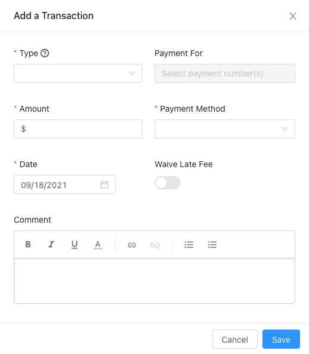

A transaction in the Lendiom system represents any time there is an exchange of money. For example, a down payment is paid or a regular payment is made.

## New Transaction Screen

Below is a screenshot of the screen where you enter in the details of a new transaction.

## Input Descriptions
Generally, once a transaction is created none of the values can be changed, however, there are two exceptions. The first exception is that you can change the status. The second exception is that you can reverse a transaction, which is an "undo" for a transaction.

### Transaction Type {#input-type}
The transaction type determines how the money is applied against the loan. For a detailed description of what each type is, please see the [Transaction Application Flow](#transaction-flow) section below.

### Payment For {#input-payment-for}
When the [Transaction Type](#input-type) is a [Regular Payment](#type-regular), this input is enabled. One or more payments can be selected. Payments which have been paid in full will not appear. The payments which have an asterisk `*` in front of them are late. //TODO: explain this in depth

### Amount {#input-amount}
The amount of money in the transaction. Whenever any number of payments are selected, this input will be populated with the sum total of the payments.

### Payment Method {#input-payment-method}
The way in which the money was exchanged. The current options are:
* Credit/Debit Card
* Cash
* Check
* Bank Transfer (ACH)
* Cash App
* Venmo

### Date {#input-date}
When the transaction happened.

:::note

Transactions must be applied in sequential order (oldest to newest).

:::

### Waive Late Fee {#input-waive-late-fee}
If the date of the transaction is after the due date of a selected payment, this input will be enabled. Waiving the late fee will reverse an late fee which has been applied automatically.

### Status {#input-status}
Whenever the [Transaction Type](#input-type) is **Regular Payment**, a *Status* input will show up. This allows you to set a transaction as any of the following:
* Pending
* Success
* Failure
* Reversed

:::tip

One great use case of the Status field is whenever someone makes a payment that will take a few days for the money to clear.

**An example:** A buyer sends you money via the Cash App and you use the standard cash out option which takes two days.
Create the transaction with the date of when they sent you the money and then change the status of the transaction when the money shows up in your bank account.

:::

## Transaction Application Flow {#transaction-flow}
Whenever a payment is applied, a certain sequence is followed to ensure the funds are correctly distributed and calculated. The flow followed depends on the [Transaction Type](#input-type) which was selected when the transaction was created.

### Regular Payment {#type-regular}
A regular payment has the highest complexity out of all of the [Transaction Types](#input-type).

:::warning

The regular payment transaction application flow is not complete.

:::

### Principal Payment {#type-principal}
A principal payment [transaction type](#input-type) means that **100%** of the amount goes towards the principal.

### Late Fee {#type-late-fee}
If you need to manually apply a late fee, this will add it to the loan's late fee balance due. This is **not** a payment of a late fee.

### Down Payment {#type-down-payment}
This type of transaction is only for your record keeping, it does *nothing* to the amount of principal due.

### Closing Fees {#type-closing-fees}
Another transaction type which is for record keeping only.

### Documentation Fee {#type-documentation-fees}
Documentation Fee is for your record keeping.
