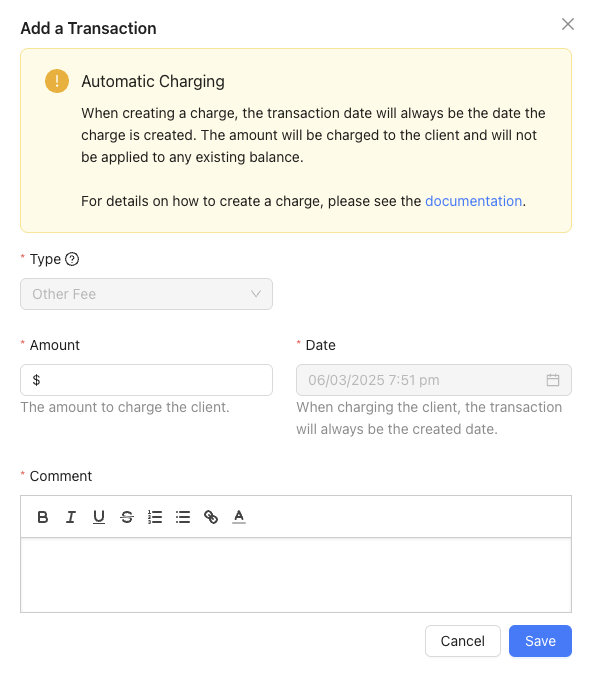

When charging the client for a fee, such as insufficient funds or requiring reimbursement of a letter sent, Lendiom only allows you to do it via the charge modal. Currently, Lendiom treats it as an "Other Fee" transaction type.

## Charge Transaction Screen

Below is a screenshot of the screen where you enter in the details of what you are wanting to charge.

## How it Works

Lendiom will create a negative other fee transaction to record the charge you want to do. Lendiom will go through the normal process of creating a transaction for Other Fees, including updating the balance due on the loan.

Once the system finishes that, then Lendiom will create a second transaction and charge the client's default payment method - whether that is a card or bank account. This process then reduces the loan's other fee balance.

## Requirements

- PayArc Processing to be Enabled
- The client to have an enabled default payment method
- Charging Enabled on your business

### Enabling Charging

To enable this feature on your account, please contact support. We will require proof that your clients have signed a document or contract authorizing you to charge their payment method on file with Lendiom. This can be your contract that has verbiage stating this or an addendum to the contract. We are not attorneys and thus can not, and will not, recommend the verbiage for you to include in your contract or the addendum to have them sign.
