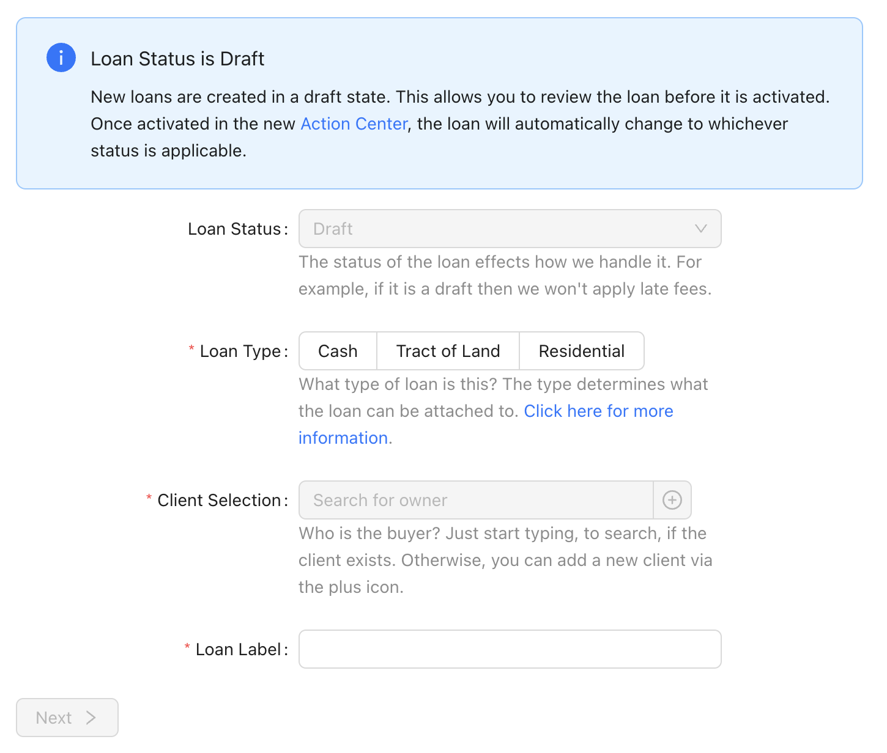
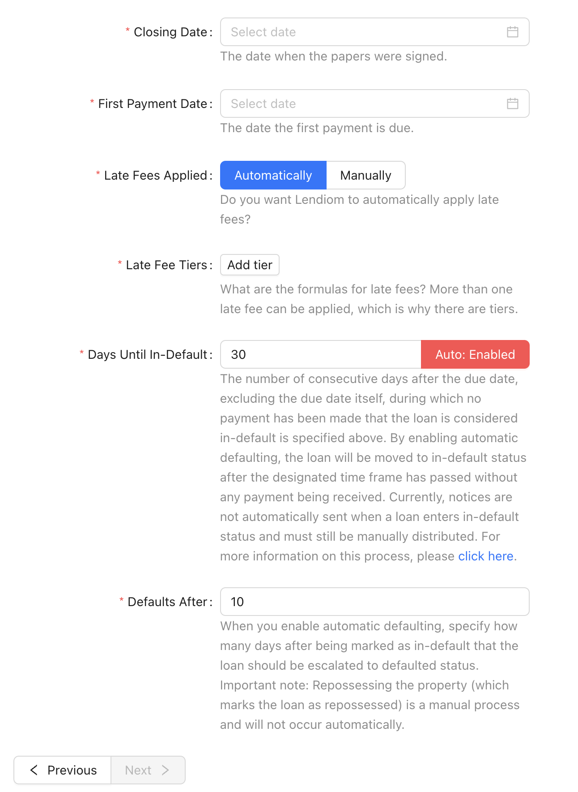
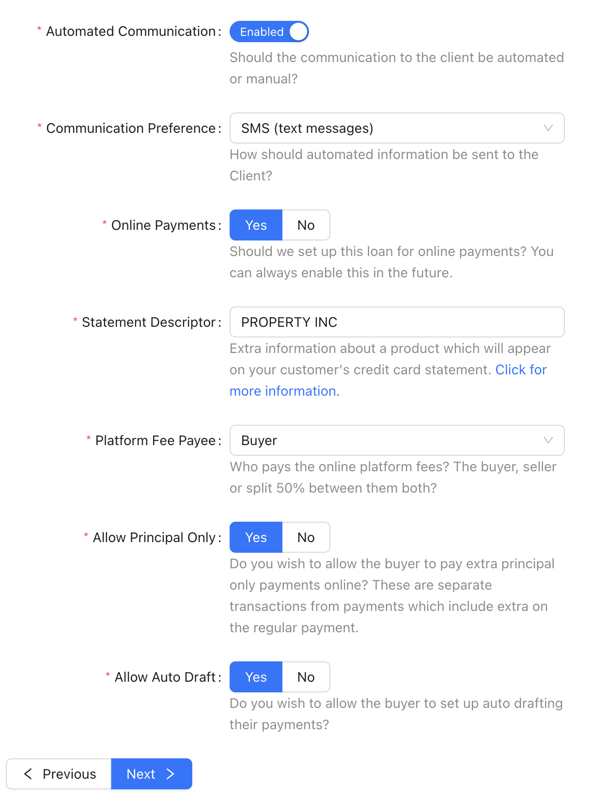
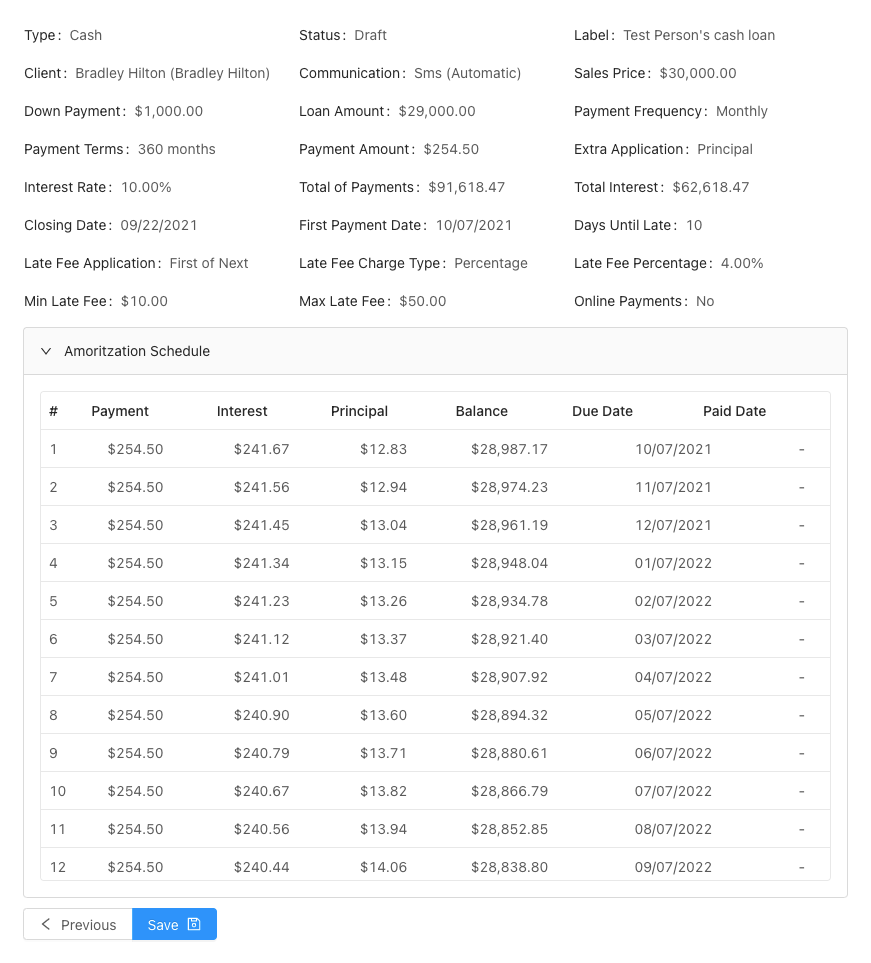

A loan in the Lendiom system represents a real loan. This resource contains all of the characteristics and configurations which make up the loan. The loan can represent an owner financed loan, a cash loan or anything else where a sum of money is owed that is expected to be paid back with interest.

As of the release *v0.15.0*, pre-existing loans can now be created in the system. By pre-existing, we mean that you can enter the details of how much principal and interest has already been paid along with when the next due date when creating a loan. The information provided then allows us to create a loan and correctly generate the amortization and payment schedule.

The current process for creating a loan consists of five steps. We will describe each step below and what each input (configuration option) means.

## Step 1: What & Who {#step1}
The first step consists of telling the system what the loan is for and who the loan is for, plus a few more details.

### Loan Status {#step1-status}
When creating a loan, we ask what the status or state the loan is in. The options are:
* Active
* Inactive
* Late
* In Default
* Draft

:::tip Tip: Draft Status

We highly recommend utilizing the **Draft** status when creating a loan. When a loan is in a draft status, the system does not apply any late fees and you can easily delete the loan if you misconfigured something.

Why would you want any late fees to **not** be applied? A prime example of this is whenever you are moving your loans over into our system and manually entering in the transactions and payments. This way you can set the correct close and due dates and not have to worry about the system applying late fees when you are entering the past payments. Then once you have all of the previous payments entered, you can take the loan out of draft status and let the system take over.

:::

### Loan Type {#step1-type}
Currently there can only be two types of loans. A **Cash** loan or a **Tract of Land** loan.

### Loan Tract Selection {#step1-tract-selection}
Whenever the [loan type](#step1-type) is a tract of land, the tract must be selected. It will drop down a list of the developments and the tracts in each development. For a tract to be selectable, it must be available and no other active loan can be against the tract of land (can not be marked as sold).

### Client Selection {#step1-client}
Who is the loan for? The client must exist in the system already.

### Loan Label {#step1-label}
The loan label is for your reference and the client's reference (when using [Lendiom Pay](/docs/pay/)). The system auto generates a label based upon the loan type, tract of land selection and the client. We highly recommend customizing the label for you and your client to easily recognize it.

### Step 1 Screenshot

## Step 2: Terms {#step2}
The third step is for setting the terms of the loan. So, when the due date is and how late fees are charged.

### Closing Date {#step2-closing-date}
The closing date is when the papers are going to be signed or were signed. This is primarily for your record keeping and does not effect any loan calculations.

### First Payment Date {#step2-first-payment-date}
The first day the payment is due. This date then sets whenever the following due dates are. For example, if the due date is the March 1st, 2021 then the due date will be the first of each month that follows until the loan is paid in full.

### Days Until Date {#step2-grace-period}
How long the payee has after the due date until the payment is considered late. This is also known as the due date **grace period**.

### Late Fee Application {#step2-late-fee-application}
The late fee application determines how the late fee should be applied to the loan. The options are:
* First Part of Next Payment
* Added to Principal

:::tip

If your indicates that the late fee will be paid first out of the next payment that comes in, then select the **First Part of Next Payment**. Payments which come in with this selected with result in a payment allocation as follows:

1. Late Fee
2. Interest
3. Principal

:::

### Late Fee Charge Type {#step2-late-fee-charge-type}
The type of late fee charge determines how the late fee will be calculated. The options are:
* Fixed Amount
* Percentage

### Fixed Late Fee Amount {#step2-late-fee-fixed}
If the late fee charge type is **Fixed Amount**, then this input will determine how much the late fee will be.

### Late Fee Percentage {#step2-late-fee-percent}
When the late fee charge type is **Percentage**, what is the percentage fee for the late fee?

### Min Late Fee {#step2-min-late-fee}
What is the lowest amount that the late fee can be? So, if the percentage above results in a calculated fee lower than this minimum, then this minimum amount will be charged.

### Max Late Fee {#step2-max-late-fee}
What is the highest amount that the late fee can be? So, if the percentage above results in a calculated fee higher than this maximum, then the maximum amount will be charged.

### Step 2 Screenshot

## Step 3: How Much {#step3}
The second step consists of telling the system how much the loan is for and several details surrounding the pricing.

### Sales Price {#step3-price}
Sales price refers to how much they agreed to pay prior to putting any money down. Or, if doing a cash loan, how much they agreed to borrow before putting any money down.

### Down Payment {#step3-downpayment}
Down payment is the amount of money the Client (buyer) is putting down against the principal as part of the initial agreement.

### Amount Financed {#step3-amt-financed}
This input is a calculated value based upon the previous two inputs. It subtracts the down payment from the sales price.

### Years {#step3-years}
How long the loan will be financed for in terms of years.

### Interest Rate {#step3-rate}
The rate at which the loan is charged interest. Currently Lendiom only supports a fixed interest rate (for now).

### Monthly Payment {#step3-payment}
How much the monthly payment will be based upon the provided terms. This is a calculated value. Should this value ever be anything different than what you expected, please get with support and include how you calculated your monthly payment.

### Extra Payment Application {#step3-extra-application}
When extra is paid on a payment, this value determines where the extra amount should be applied to. There are currently two options:

* Principal
* Next Payment

The **Principal** option applies the extra paid amount directly to the principal.

:::note Example of Principal

The monthly payment is $475.00 but they pay $500. When the extra payment application is *Principal* then the extra $25 will go towards the loan's principal.

:::

The **Next Payment** option applies any extra paid amount to the next month's payment. This means that if someone was to pay a few dollars extra every month then eventually they will have paid an extra month ahead as it does roll over.

:::note Example of Next Payment

Let's say that the monthly payment is $225. We have a client who pays a $250 every month, which is $25 extra. The extra will be applied to next month's payment. This means that after 9 months of doing this the client will be one month ahead.

:::

### New or Existing Loan {#step3-new-or-existing}
Whenever you create creating an existing loan, this value enables the extra inputs for creating a loan based on an existing one. For more information about creating an existing loan, please see: [Creating a Pre-Existing Loan](./creating-a-pre-existing-loan)

### Step 3 Screenshot

## Step 4: Communication {#step4}
In step four, you configure whether or not the communication with the client is automated and what their preference is.

### Automated Communication {#step3-auto-communication}
Should the communication to the client be automated or manual?

### Communication Preference {#step3-communication-pref}
Currently the only supported preference is SMS (aka text messages). At the moment Lendiom sends them messages about an upcoming payment due date, past due dates and more. However, the client must have a mobile number in the system.

### Step 4 Screenshot

## Step 5: Review {#step5}
The fifth, and final, step is to review all of the data which you have entered before saving it. The review also includes an amortization schedule. Once you have reviewed all of the data and double checked it is correct, click the **Save** button and you are done creating the loan!

### Step 5 Screenshot

