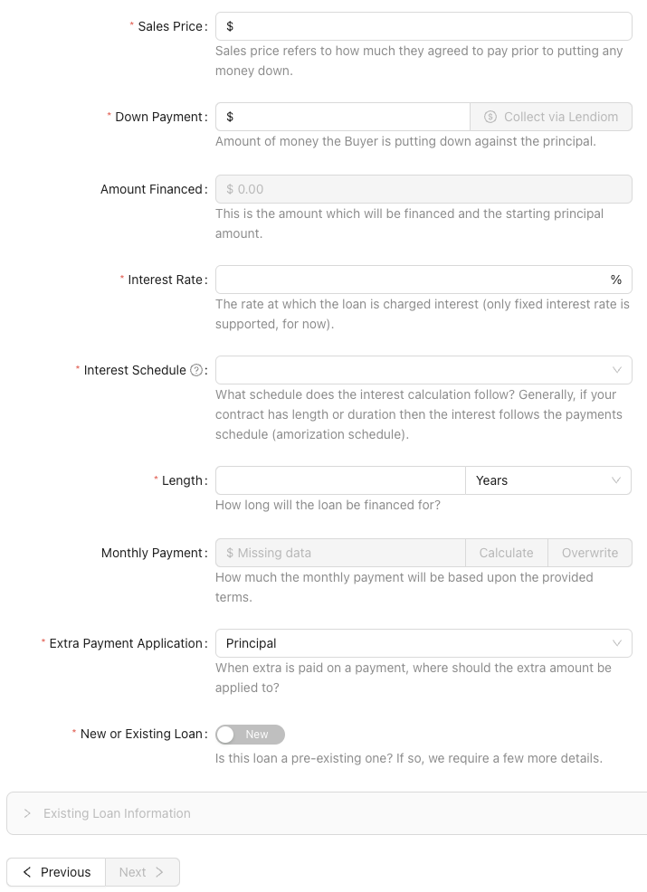
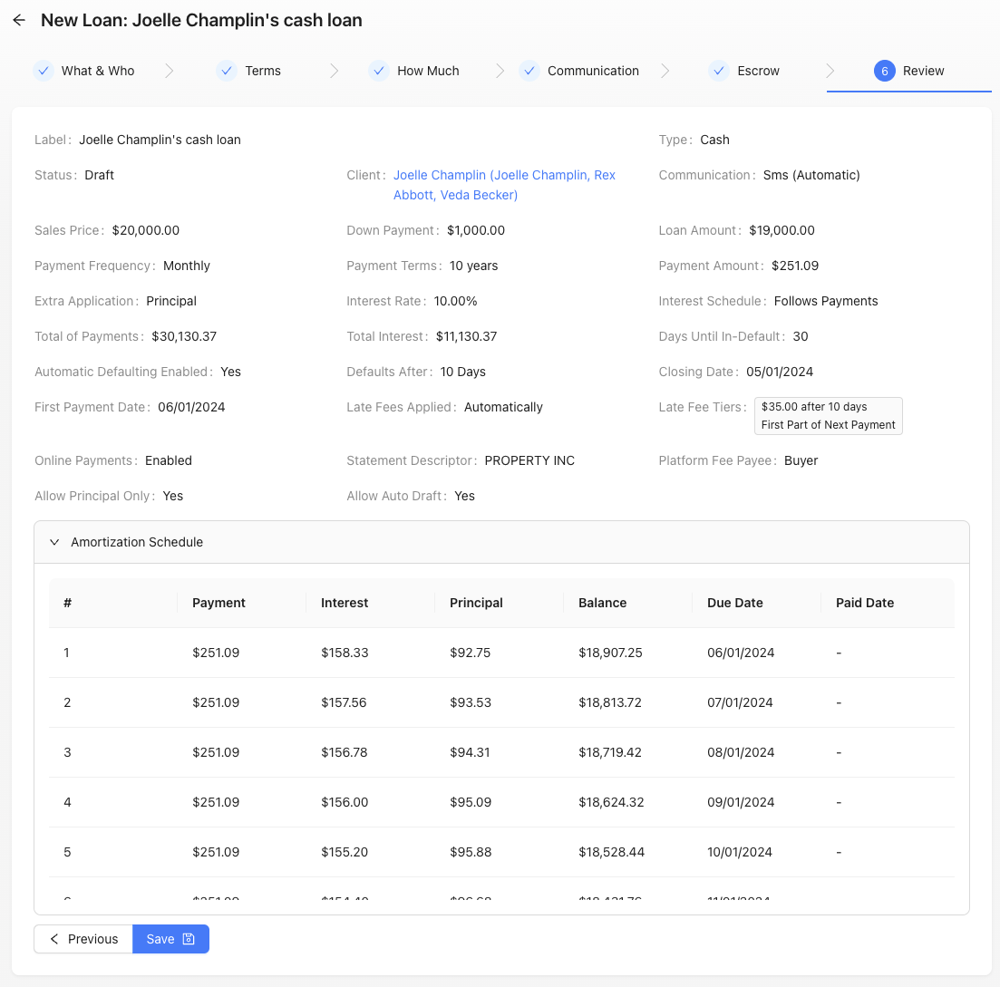

A loan in the Lendiom system represents a real loan. This resource contains all of the characteristics and configurations which make up the loan. The loan can represent an owner financed loan, a cash loan or anything else where a sum of money is owed that is expected to be paid back with (or without) interest.

As of the release *v0.15.0*, pre-existing loans can now be created in the system. By pre-existing, we mean that you can enter the details of how much principal and interest has already been paid along with when the next due date when creating a loan. The information provided then allows us to create a loan and correctly generate the amortization and payment schedule.

The current process for creating a loan consists of six steps. We will describe each step below and what each input (configuration option) means.

## Step 1: What & Who {#step1}
The first step consists of telling the system what the loan is for and who the loan is for, plus a few more details.

### Loan Status {#step1-status}
When creating a loan, the status will always be in the **Draft** status. After you save the loan, you will be able to make it active in the [Action Center](../how-it-works/loan-action-center) of the loan. For more details about the possible statuses of a loan, please see the [how it works page](../how-it-works/loan-status).

:::info Why Draft?

Starting in v0.40.0, all loans will be saved as a **Draft**. We made this change as you can now collect down payments via Lendiom. But we also made this change to give people more time to review the details of a loan they created. 

:::

### Loan Type {#step1-type}
The type of loan determines what can be attached to the loan.

* **Cash** - Only need to select a client, basically a hard money loan
* **Tract of Land** - Enables selecting one or more tracts of land
* **Residential** - Enables selecting a residential (house) inventory

### Loan Tract Selection {#step1-tract-selection}
Whenever the [loan type](#step1-type) is a tract of land, you must first select the inventory and then select the tract(s). For a tract to be selectable, it must be **available** and have no other active loan can be against the tract of land (can not be marked as sold). Also, more than one tract can be selected at a time (no longer requires combining tracts together).

### Client Selection {#step1-client}
Who is the loan for? The client must exist in the system already or you can use the plus button to quickly create a new client. The client is the person who is going to be paying back the loan.

### Loan Label {#step1-label}
The loan label is for your reference and the client's reference (when using [Lendiom Pay](/pay/)). The system auto generates a label based upon the loan type, tract of land selection and the client. We highly recommend customizing the label for you and your client to easily recognize it.

### Step 1 Screenshot

## Step 2: Terms {#step2}
The third step is for setting the terms of the loan. So, when the due date is and how late fees are charged.

### Closing Date {#step2-closing-date}
The closing date is when the papers are going to be signed or were signed. This is primarily for your record keeping and does not effect any loan calculations.

### First Payment Date {#step2-first-payment-date}
The first day the payment is due. This date then sets whenever the following due dates are. For example, if the due date is the March 1st, 2021 then the due date will be the first of each month that follows until the loan is paid in full.

### Late Fees Applied
Whether or not you want the late fees applied automatically or manually.

### Late Fee Tiers
A late fee tier tells Lendiom how and when to apply a late fee or multiple late fees. For more information, please see the [how late fees works page](../how-it-works/late-fees).

### Days Until In-Default {#step2-days-until-in-default}
Specify how many days after the due date (excluding the due date itself) that a loan should be considered in-default.
This field is required and can be set between 1 and 365 days.
When automatic in-defaulting is enabled, the system will automatically mark the loan as in-default and send a SMS notification to the buyer.
Note that letters are not sent automatically and must be mailed manually.
To restore the loan to Current status, the buyer must pay the full amount due, including all applicable late fees.

### Defaults After {#step2-defaults-after}
If you enable automatic in-defaulting, this field is required. It specifies the number of days after the loan enters in-default status that the system will automatically escalate it to defaulted status.
You can set this time frame between 1 and 365 days.
**Important note:** Repossessing the property (which marks the loan as repossessed) is a manual process and will not occur automatically.

### Step 2 Screenshot

## Step 3: How Much {#step3}
The second step consists of telling the system about the terms of the loan.

### Sales Price {#step3-price}
The sales price refers to the initial amount that the buyer agrees to pay before making any down payment or adjustments.
Alternatively, in the case of a cash loan, it is the principal amount borrowed prior to disbursing any funds.

### Down Payment {#step3-downpayment}
Down payment is the amount of money the Client (buyer) is putting down against the principal as part of the initial agreement.

Since February 2024, you can now natively collect the down payment from within Lendiom. The button **Collect via Lendiom** will open a modal asking for more details. [Click here for more information.](../how-it-works/down-payments.md)

:::info PayArc Requirement

You must be setup to process payments with PayArc to collect down payments via Lendiom.

:::

### Amount Financed {#step3-amt-financed}
The amount financed is a calculated value based upon the previous two inputs. It subtracts the down payment from the sales price.

### Interest Rate {#step3-rate}
The interest rate represents the percentage at which interest accrues on a loan. At present, Lendiom exclusively offers fixed interest rates, meaning that the borrower is charged a constant rate of interest throughout the loan term.

### Interest Schedule {#step3-interest-schedule}
There are a few ways interest can be calculated. At the moment, Lendiom only supports two of them:

* Accrues Daily
* Follows Payment Schedule

When you select **Accrues Daily**, the interest needed is based on the remaining principal balance and the amount of days since their last payment. When the amount of interest needed is more than the current payment amount, the unpaid interest is added to a interest balance and is required to be paid first on the next payment.

:::note Example of Accrues Daily

The remaining principal balance is \$29,000 with an interest rate of 10% and a monthly payment of \$254.50. The buyer pays their payment 5 days after the due date. The amount towards interest would be $281.94. The formula for calculating interest due is:

$A=P*\frac I Y*D$

`A` = Accrued interest

`P` = Principal Due

`I` = Interest Rate

`Y` = Days in the Year (360, 365)

`D` = Days since Last Payment

:::

When you select **Follows Payment Schedule**, the interest needed is based on the payment schedule (also known as amortization schedule). When the buyer pays their payment, the interest needed is based on how much the payment schedule determines it is.

### Length {#step3-length}
How long the loan will be financed for, can be in either years or months.

### Monthly Payment {#step3-payment}
The monthly payment amount is a calculated value based on the provided loan terms.
While users have the option to overwrite this calculated value with a custom amount,
we strongly advise ensuring that the custom amount is higher than the minimum required payment.
This is crucial to avoid a scenario where the loan becomes perpetual.
If the calculated monthly payment amount differs from your expectations,
please reach out to our support team and provide the mathematical formula used to
calculate your expected monthly payment for assistance.

### Extra Payment Application {#step3-extra-application}
When extra is paid on a payment, this value determines where the extra amount should be put towards. There are currently two options:

* Principal
* Next Payment

The **Principal** option applies the extra paid amount directly to the principal.

:::note Example of Principal

The monthly payment is $475.00 but they pay $500. When the extra payment application is *Principal* then the extra $25 will go towards the loan's principal.

:::

The **Next Payment** option applies any extra paid amount to the next month's payment. This means that if someone was to pay a few dollars extra every month then eventually they will have paid an extra month ahead as it does roll over.

:::note Example of Next Payment

Let's say that the monthly payment is $225. We have a client who pays a $250 every month, which is $25 extra. The extra will be applied to next month's payment. This means that after 9 months of doing this the client will be one month ahead.

:::

### New or Existing Loan {#step3-new-or-existing}
Whenever you create creating an existing loan, this value enables the extra inputs for creating a loan based on an existing one. For more information about creating an existing loan, please see: [Creating a Pre-Existing Loan](./creating-a-pre-existing-loan)

### Step 3 Screenshot

## Step 4: Communication {#step4}
In step four, you will configure the communication settings for the client,
including whether automated communication is enabled and the client's preferred method of communication.
Additionally, this step involves setting up online payment options and customizing the buyer's experience in their
Lendiom Pay portal, determining what actions they are allowed to perform within the platform.

### Automated Communication {#step4-auto-communication}
Should the communication to the client be automated or manual?

:::note Communication Portal Required

As of October 1, 2022, all businesses (organizations) must have a communication portal setup to send SMS messages.

Please see the [communication portal guide](../communication.md) for more information.

:::

### Communication Preference {#step4-communication-pref}
Currently the only supported preference is SMS (aka text messages). At the moment Lendiom sends them messages about an upcoming payment due date, past due dates and more. However, the client must have a mobile number in the system.

### Online Payments
This yes or no question determines if the client can pay their loan online via Lendiom Pay. If you enable this option, the client will be able to pay their loan online via Lendiom Pay.

:::note PayArc Requirement

Starting in December 2024, all businesses will need to be setup with PayArc to collect payments via Lendiom Pay.

Please see the [PayArc guide](../payment-processing/onboarding-payarc.md) for more information.

:::

### Statement Descriptor
The statement descriptor is what the client will see on their bank statement when they pay their loan via Lendiom Pay. The statement descriptor is limited to 22 characters and a minimum of 5 characters. For more information, please see Stripe's [statement descriptor guide](https://docs.stripe.com/get-started/account/statement-descriptors).

### Platform Fee Payee
The platform fee payee is who pays the platform fee when the client pays their loan via Lendiom Pay.
Currently there are three options:

- Buyer
- Seller
- Split 50/50

When the value is Buyer, the buyer will pay 100% of the platform fee. When the value is Seller, the seller will pay 100% of the platform fee. When the value is Split 50/50, the buyer and seller will each pay 50% of the platform fee.

### Allow Principal Only
This option enables a Principal Only payment option on Lendiom Pay. This is useful when the client wants to pay off the loan early.

### Allow Auto Draft
This option enables the client to setup automatic payments via Lendiom Pay. This is useful when the client wants to ensure that they never miss a payment.

### Step 4 Screenshot

## Step 5: Escrow {#step5}
Escrow includes anything such as taxes, insurance, or other fees that are paid on a regular basis. If property taxes are paid in a lump sum, you may not need to collect escrow. For property taxes, Lendiom has a feature set dedicated for collecting reimbursement of property taxes. [Please see here for more information](./property-taxes.md).

### Collect Escrow
This is a simple yes or no answer, do you want to collect escrow? It defaults to false as most owner financed loans/contracts do not collect escrow (unless there is a house or the land is improved with a building).

### Escrow Starting Balance
The starting balance is the amount of money that is already in the escrow account. This is useful when you are creating a pre-existing loan and the buyer has already paid some escrow.

### Escrow Payment Amount
The escrow payment amount is how much the buyer will pay towards the escrow account each month. This amount is added to the monthly payment.

### Escrow Application Step
The escrow application step is when the escrow is took out of the payments. The options are:
- Before Interest
- After Principal

The majority of the time the escrow is taken out before the interest is calculated, to ensure the escrow is always paid.

## Step 6: Review {#step6}
The fifth, and final, step is to review all of the data which you have entered before saving it. The review also includes an amortization schedule. Once you have reviewed all of the data and double checked it is correct, click the **Save** button and you are done creating the loan!

### Step 6 Screenshot

