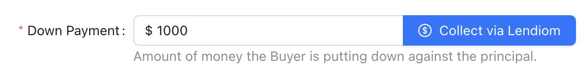
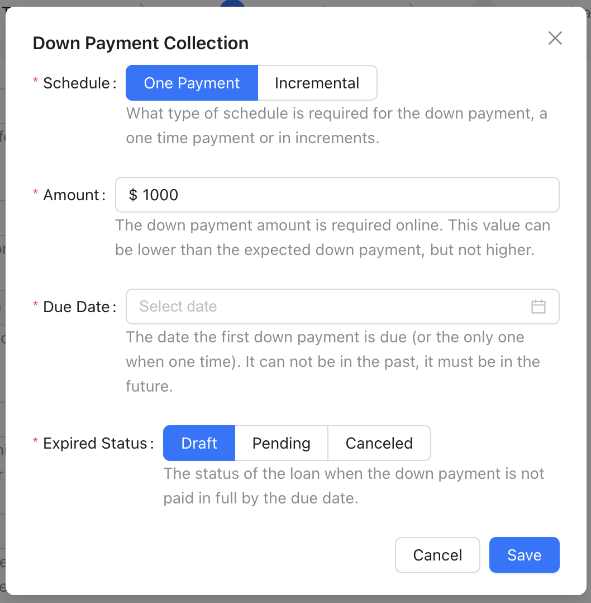
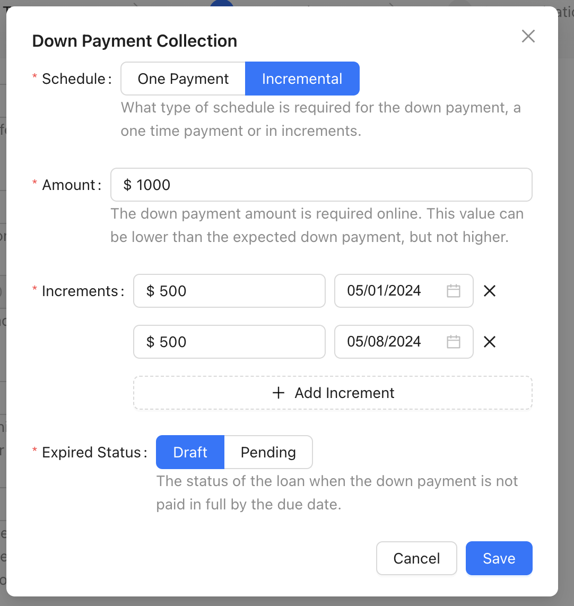
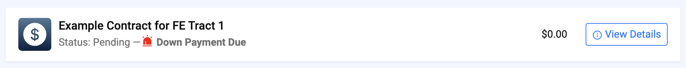
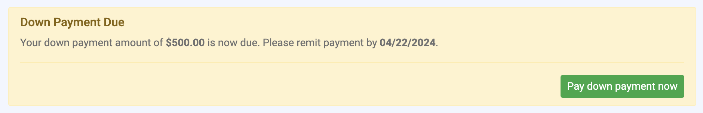
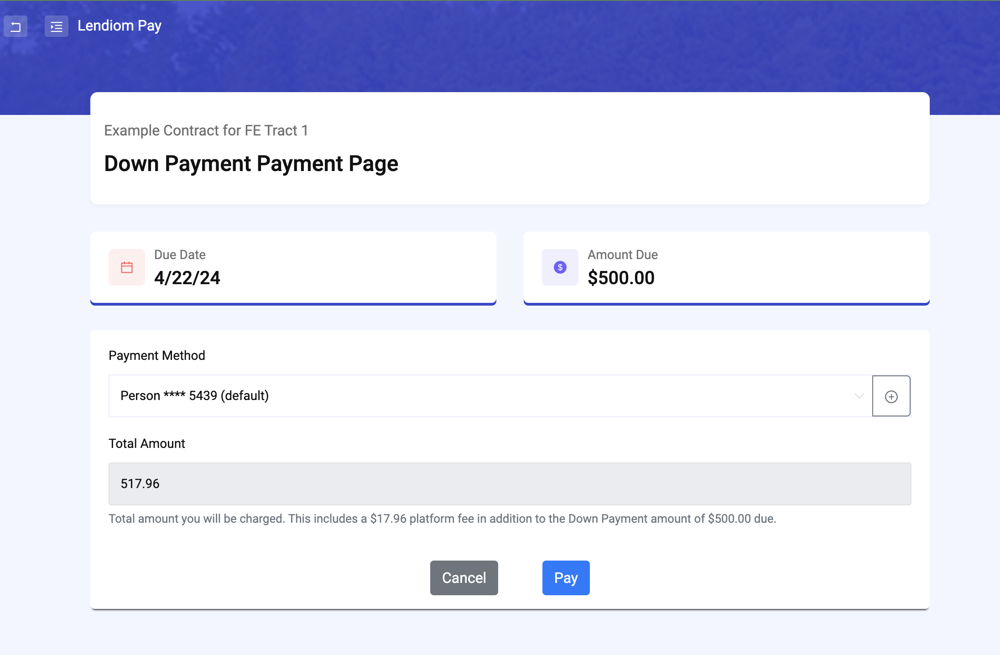

## Introduction
Prior to [version](../faq.md#check-version) `v0.40.0` of Lendiom, collecting down payments online involved a work around or sending an invoice via [Stripe](../payment-processing/stripe.md) or [PayArc](../payment-processing/payarc.md). With the introduction of the [Loan Action Center](./loan-action-center.md), we also introduced the capability to collect down payments online.

:::note
Collecting down payments online requires being set up with the [PayArc payment processor](../payment-processing/payarc.md). [Stripe](../payment-processing/stripe.md) is not supported for online down payments.
:::

### Enabling Collecting Down Payments Online
To enable collecting down payments online, you must first be set up with [PayArc](../payment-processing/payarc.md). After that, when creating a loan, you can enable the option to collect a down payment online. This will allow the buyer to pay the down payment online via Lendiom Pay.

Lendiom supports collecting either a lump sum down payment or incremental down payments. Incremental down payments allow the buyer to pay the down payment in multiple payments. Additionally, the expected online down payment can be less than the total down payment to account for any down payment already collected offline.

When creating the loan, you can specify the expected down payment amount and the expected online down payment amount. The expected online down payment amount is the amount that the buyer will be expected to pay online. The expected down payment amount is the total down payment amount that the buyer is expected to pay. You can also specify the down payment due date, or due dates if you are collecting incremental down payments. The last piece of information you can specify is the status that the loan should move to if the down payment is not paid by the due date. This will allow you to cancel the loan (if lump sum), or move the loan to a pending status or to draft status.

Please note that if the down payment is not paid by the due date and the system moves the loan into the status configured, the buyer will no longer be able to pay the down payment online. They will need to contact you to make arrangements for the down payment. Unless you move the loan back to an [active status](./loan-status.md#active-statuses) (such as pending). However, Lendiom will not adjust the status of the loan because of the down payment not being paid, that happens only once.

### Down Payment Collection Modal
When telling Lendiom to collect a down payment online, you will click the **Collect via Lendiom** button on the new loan wizard, step 3 (how much). This will open a modal that allows you to specify the details of the down payment collection.

The details needed are:
* Schedule - One Payment (aka Lump Sum) or Incremental (aka Multiple Payments)
* Amount - Total online down payment amount, must be less than or equal to the total down payment amount
* Due Date - The date that the down payment is due, only provided if the schedule is one payment
* Expired Status - The status that the loan should move to if the down payment is not paid by the due date (`canceled` can only be selected if expecting a lump sum)

#### Lump Sum Down Payment Modal

#### Incremental Down Payment Modal

### Buyer Experience
When the buyer logs into their Lendiom Pay portal, they will see their list of loans that they have with you. When a loan has an online down payment that is due, they will see a notice on the loan card that the down payment is due.

When they click into the loan, they will see a notice at the top of the loan details page that the down payment is due. They will also see a button to pay the down payment.

When they click the **Pay down payment now** button, they will be taken to the payment page where they can pay the down payment.

Once they click the **Pay** button, the payment will be processed and the loan will be updated to reflect that the down payment has been paid. If there are still down payment increments to be paid, the buyer will still see a notice that the down payment is due.

### Buyer Messages and Reminders

:::info
The [Communication Portal](../communication.md) must be active to send messages and reminders to the buyer.
:::

#### Upcoming Down Payment due

When the buyer has a down payment due, they will receive several text messages to remind them that the down payment is due.

The first message will be sent 5 days before the due date. This message will remind the buyer that the down payment is due soon.

> Hi [Buyer Name], your down payment to [Company Name] of $[Amount] is due on [Date]. Access your account at: https://go.lendiom.com/d/b3uQ3q-Ig
> 
> Reply STOP to opt out from msgs.

#### Down Payment Due Today
The next message will be sent on the due date. This message will remind the buyer that the down payment is due that day.

> Hello [Buyer Name], [Company Name] would like to remind you that your down payment of $[Amount] is due today. Access your account at: https://go.lendiom.com/d/b2uQ3q-Ig
> 
> Reply STOP to opt out from msgs.

#### Down Payment Missed
Then if they fail to make the down payment, they will receive a message the day after the due date. This message will inform the buyer to contact the company to make arrangements for the down payment.

> Hi [Buyer Name], unfortunately the down payment that was due on [Date] for [Inventory and Tract Name] is now past due. Please contact [Company Name] to make arrangements as soon as possible since online down payments are no longer possible. Thank you.
> 
> Reply STOP to opt out from msgs.
