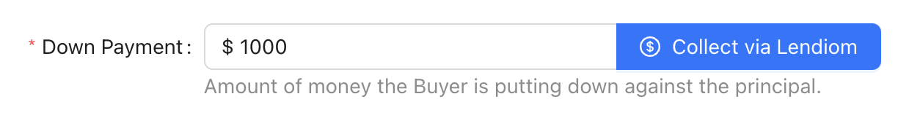
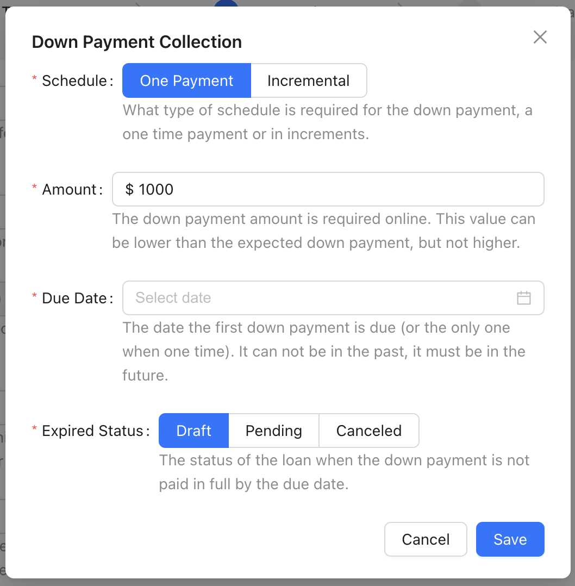
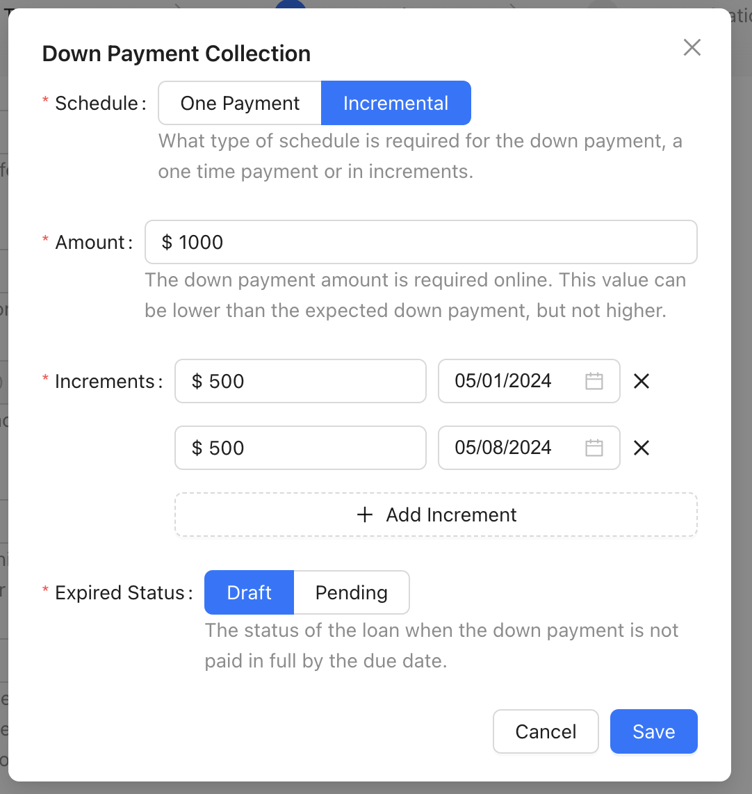
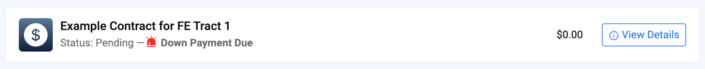
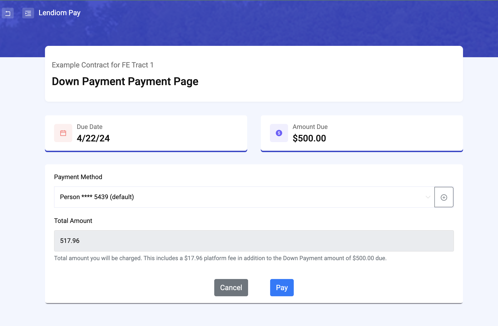

## Introduction
Prior to [version](../faq.md#check-version) `v0.40.0` of Lendiom, collecting down payments online involved a work around or sending an invoice via [Stripe](../payment-processing/stripe.md) or [PayArc](../payment-processing/payarc.md). With the introduction of the [Loan Action Center](./loan-action-center.md), we also introduced the capability to collect down payments online.

:::note
Collecting down payments online requires being set up with the [PayArc payment processor](../payment-processing/payarc.md). [Stripe](../payment-processing/stripe.md) is not supported for online down payments.
:::

### Enabling Collecting Down Payments Online
To enable online down payments, you must first set up a merchant account with [PayArc](../payment-processing/payarc.md). Once setup, when creating a loan, you can opt to collect a down payment online, allowing the buyer to make the payment via Lendiom Pay.

Lendiom supports two types of online down payments: lump sum and incremental. Incremental down payments permit buyers to pay the down payment in multiple installments. Additionally, the expected online down payment amount can be set to less than the total down payment amount to account for any offline down payments already collected.

When creating a loan, you can specify the following details: the expected down payment amount (the total amount due), the expected online down payment amount (the amount payable online), and the down payment due date or dates (if collecting incremental down payments). You can also configure the loan status that should be triggered if the down payment is not made by the specified deadline. This allows you to cancel the loan (for lump sum payments), move it to a pending or draft status, or take other desired actions.

Please note that if the down payment remains unpaid by the due date and the system updates the loan status accordingly, the buyer will no longer be able to make the online down payment. They will need to contact you directly to arrange for the down payment. However, unless you manually move the loan back to an [active status](./loan-status.md#active-statuses) (such as pending), Lendiom will not automatically adjust the loan status due to non-payment of the down payment.

### Down Payment Collection Modal
When telling Lendiom to collect a down payment online, you will click the **Collect via Lendiom** button on the new loan wizard, step 3 (how much). This will open a modal that allows you to specify the details of the down payment collection.



The details needed are:
* Schedule - One Payment (aka Lump Sum) or Incremental (aka Multiple Payments)
* Amount - Total online down payment amount, must be less than or equal to the total down payment amount
* Due Date - The date that the down payment is due, only provided if the schedule is one payment
* Expired Status - The status that the loan should move to if the down payment is not paid by the due date (`canceled` can only be selected if expecting a lump sum)

#### Lump Sum Down Payment Modal


#### Incremental Down Payment Modal



### Buyer Experience
When the buyer logs into their Lendiom Pay portal, they will be presented with a list of their active loans with your organization.
If a loan has an online down payment that is approaching or has reached its due date, a notification will appear on the corresponding loan card,
alerting them that the down payment is pending and requires their attention.



When the buyer clicks on a specific loan from their list, they will be directed to the loan details page.
At the top of this page, a prominent notice will alert them that the online down payment is due.
Additionally, a 'Pay down payment now' button will be displayed, allowing them to conveniently initiate the payment process.


When they click the **Pay down payment now** button, they will be taken to the payment page where they can pay the down payment.



After clicking the **Pay** button, the payment will be processed and the loan status will be updated to reflect that the down payment has been made.
If there are still outstanding incremental down payments to be paid, the buyer will continue to see a notice indicating that the down payment is due, prompting them to fulfill their remaining obligations.

### Buyer Messages and Reminders

:::info
The [Communication Portal](../communication.md) must be active to send messages and reminders to the buyer.
:::

#### Upcoming Down Payment due

When the buyer has a down payment due, they will receive several text messages to remind them that the down payment is due.

The first message will be sent 5 days before the due date. This message will remind the buyer that the down payment is due soon.

```plaintext
Hi [Buyer Name], your down payment to [Company Name] of $[Amount] is due on [Date]. Access your account at: https://go.lendiom.com/d/b3uQ3q-Ig

Reply STOP to opt out from msgs.
```


#### Down Payment Due Today
The next message will be sent on the due date. This message will remind the buyer that the down payment is due that day.

```plaintext
Hello [Buyer Name], [Company Name] would like to remind you that your down payment of $[Amount] is due today. Access your account at: https://go.lendiom.com/d/b2uQ3q-Ig

Reply STOP to opt out from msgs.
```

#### Down Payment Missed
Then if they fail to make the down payment, they will receive a message the day after the due date. This message will inform the buyer to contact the company to make arrangements for the down payment.

```plaintext
Hi [Buyer Name], unfortunately the down payment that was due on [Date] for [Inventory and Tract Name] is now past due. Please contact [Company Name] to make arrangements as soon as possible since online down payments are no longer possible. Thank you.

Reply STOP to opt out from msgs.
```
