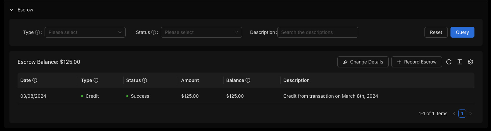

## Introduction
Escrow on loans typically refers to a financial instrument, such as an account, held by a third party on the behalf of two parties engaged in a transaction. Typically, the funds are held in escrow until it receives the appropriate instructions or until predetermined contractual obligations have been fulfilled. When the borrower makes a regular payment, a portion of that payment is put into escrow to cover the property taxes or insurance.

Inside of Lendiom, escrow works very similar. When creating a loan, the user can specify the escrow amount required on each payment. This amount is then added to the payment and put into an escrow account. This escrow account is then used to pay the property taxes or insurance when they are due. Within Lendiom, there is a dedicated section to manage the escrow balance and the payments that are made from it. This allows the user to see the history of the escrow account and the payments that have been made from it.

## Loan Creation
When creating a loan, the fifth step is to input details about the escrow. This includes the amount that is required on each payment and the type of escrow that is required. The user can also specify the initial escrow balance if there is one. Additionally, the user can specify at what point the escrow is taken out of the payment. This can be before fees, before interest, or after principal.

## Escrow Management
Once the loan has been created, the user can manage the escrow account from the loan details page. This includes viewing the history of the escrow account and the payments that have been made from it. The table of the escrow account shows the date, the amount, the type, and the balance of the escrow account. The user can also record a payment to (credit) or from (disbursement) the escrow account if needed.

### Escrow Payment Recording
When recording a new escrow entry, the user can specify the amount, the date, the status, and a description of the source or destination. The user can also specify the type, which is a credit or a disbursement. This allows the user to keep track of the payments that have been made to or from the escrow account.

:::note
The payments to escrow must be applied sequentially. This means that the user cannot record a payment to escrow that is before the last payment to escrow. This is to ensure that the escrow account is always in balance.
:::

### Escrow Updates
Every so often the amount paid to escrow will need to be updated. This can be done by editing the details of the escrow, which will then update the escrow account. This can be done by clicking the **Change Details** button on the escrow account table. This will open a drawer that allows the user to update the amount of escrow required and which step the escrow is taken out of the payment. Once saved, these changes will apply to all payments going forward.

