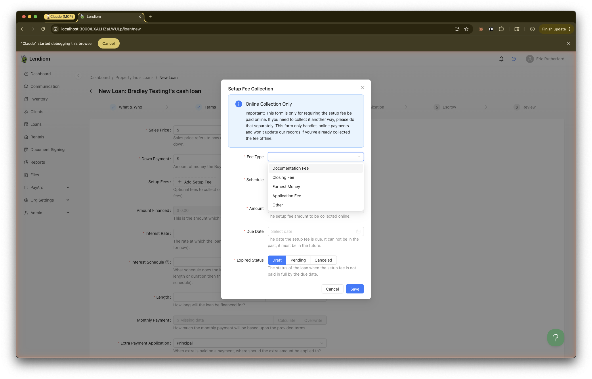
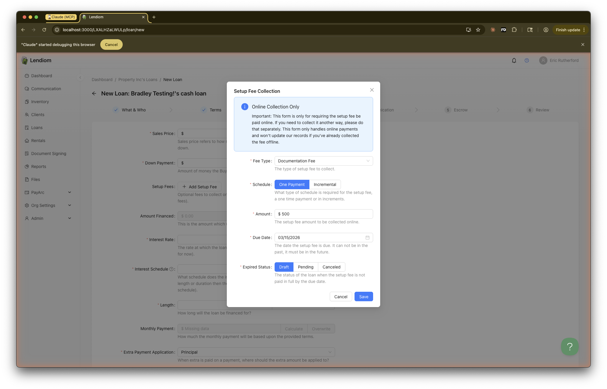
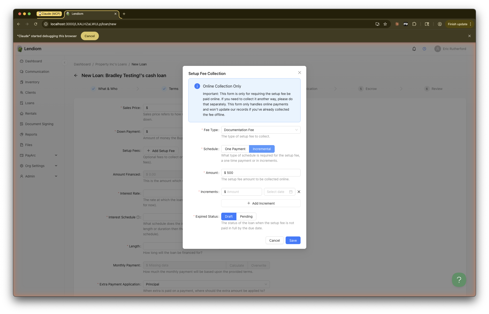
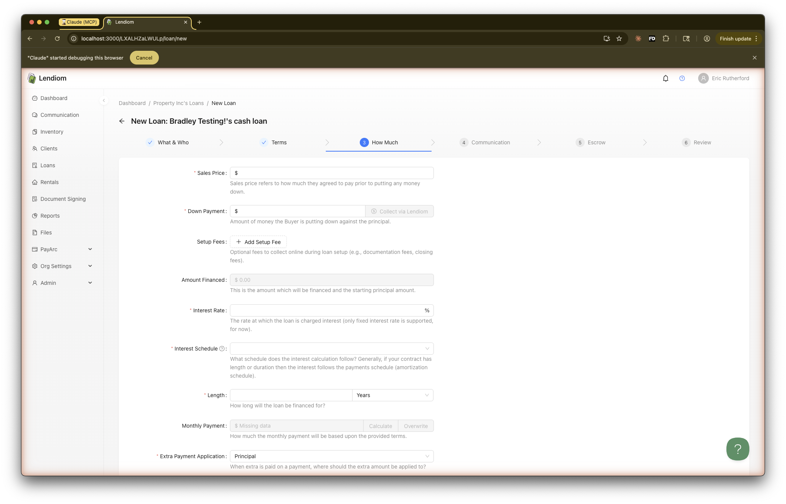
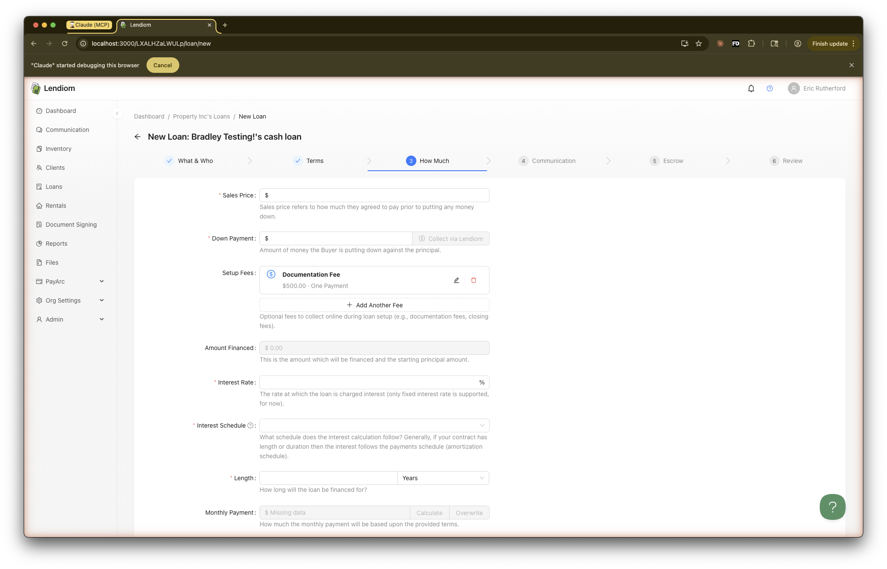
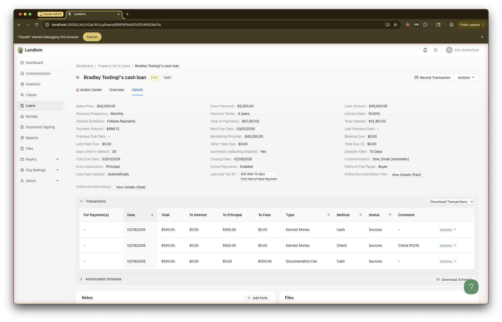
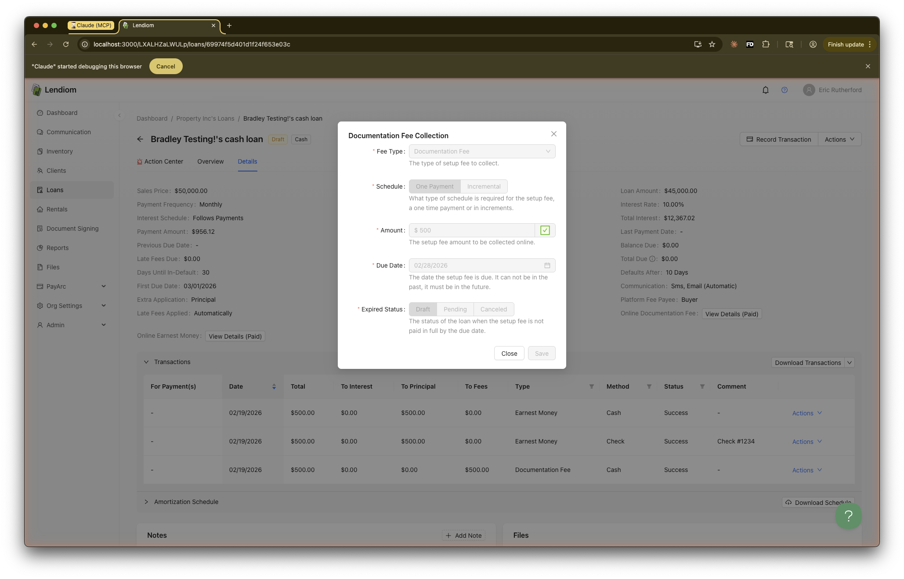
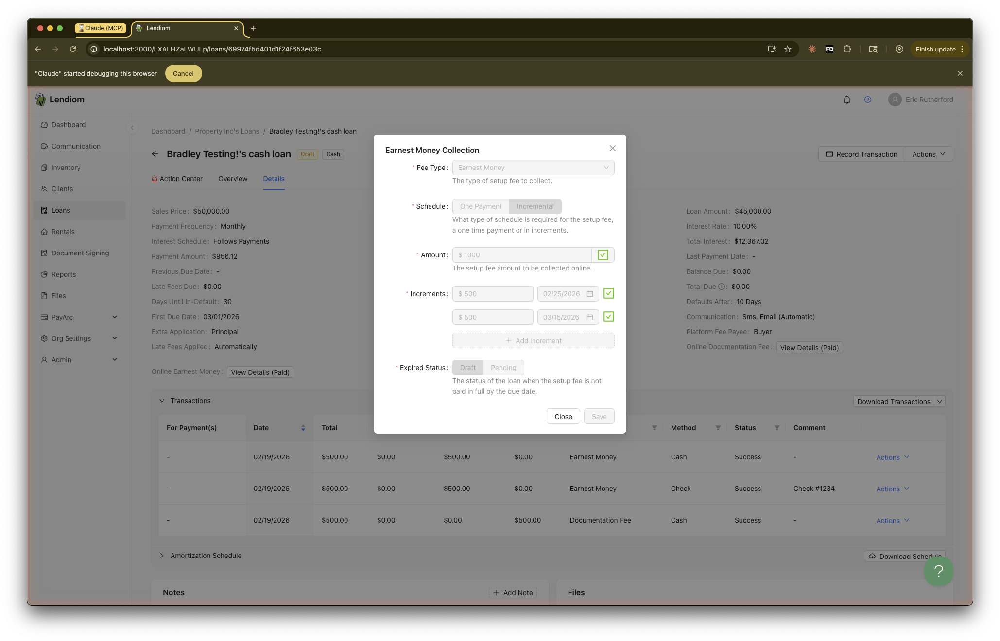

## Introduction
Setup fees allow you to collect various upfront fees from buyers online during the loan setup process. These fees are separate from the loan's down payment and monthly payments. Common examples include documentation fees, closing fees, earnest money deposits, and application fees.

Setup fees were introduced to streamline the collection of one-time charges that are typically required before or shortly after a loan is finalized. Rather than collecting these fees offline or through separate invoicing, you can configure them directly within the loan creation wizard and have buyers pay them through Lendiom Pay.

:::note PayArc Requirement
You must be set up with [PayArc](../payment-processing/payarc.md) to collect setup fees online. Setup fees are collected exclusively through online payments via Lendiom Pay.
:::

:::info Online Collection Only
The setup fee form is only for requiring the setup fee be paid online. If you need to collect it another way, please do that separately. This form only handles online payments and won't update records if you've already collected the fee offline.
:::

## Setup Fee Types
Lendiom supports the following predefined setup fee types, plus a custom option:

- **Documentation Fee** - A fee charged for preparing and processing loan documents.
- **Closing Fee** - A fee associated with the closing of the loan transaction.
- **Earnest Money** - A deposit made by the buyer to demonstrate their commitment to the purchase.
- **Application Fee** - A fee charged for processing the loan application.
- **Other** - A custom fee type where you provide your own label. Use this for any fee that doesn't fit the predefined categories.

:::info No Duplicate Fee Types
Each fee type can only be used once per loan. For example, you cannot add two separate Documentation Fees to the same loan. If you need to collect multiple custom fees, use the **Other** type with different labels for each.
:::

## Payment Schedules
Each setup fee can be configured with one of two payment schedules:

### One Payment (Lump Sum)
The buyer pays the entire fee amount in a single payment by the specified due date.

When configuring a one-time payment, you will provide:
- **Amount** - The total fee amount to collect online.
- **Due Date** - The date by which the fee must be paid. This date must be in the future.
- **Expired Status** - The loan status to set if the fee is not paid by the due date. Options are **Draft**, **Pending**, or **Canceled**.

### Incremental (Multiple Payments)
The buyer pays the fee in multiple installments, each with its own amount and due date. This is useful for larger fees where you want to allow the buyer to spread the cost over time.

When configuring incremental payments, you will provide:
- **Amount** - The total fee amount to collect online.
- **Increments** - One or more installments, each with an individual amount and due date. The sum of all increment amounts must equal the total amount.
- **Expired Status** - The loan status to set if any increment is not paid by its due date. Options are **Draft** or **Pending** (Canceled is not available for incremental payments).

You can add or remove increments using the **+ Add Increment** button and the remove button next to each increment. All increment due dates must be in the future and in chronological order.

## Adding Setup Fees During Loan Creation {#adding-setup-fees}
Setup fees are configured in **Step 3: How Much** of the loan creation wizard. You will see a **Setup Fees** section with a **+ Add Setup Fee** button.

To add a setup fee:
1. Click **+ Add Setup Fee** to open the Setup Fee Collection modal.
2. Select the **Fee Type** from the dropdown.
3. Choose the **Schedule** (One Payment or Incremental).
4. Enter the **Amount** to collect.
5. Set the **Due Date** (for one-time) or configure the **Increments** (for incremental).
6. Select the **Expired Status** to determine what happens if the fee is not paid on time.
7. Click **Save**.

After saving, the fee will appear in the Setup Fees list with its type, amount, and schedule summary. You can edit or delete a fee using the icons next to it, or add additional fees by clicking **+ Add Another Fee**.

## Viewing Setup Fees on a Loan {#viewing-setup-fees}
Once a loan has been created with setup fees, you can view them on the loan's **Details** tab. Each configured setup fee is displayed with its type and a **View Details** button. If the fee has been paid, it will show **(Paid)** next to the button.

Clicking **View Details** opens the Setup Fee Collection modal in a read-only view, showing all the configured details for that fee.

### One Payment Fee Details
For a one-time payment setup fee, the details view shows the fee type, amount, due date, and expired status.

### Incremental Fee Details
For an incremental payment setup fee, the details view shows the fee type, total amount, each increment with its amount and due date, and the expired status. Paid increments are indicated with a checkmark.

## Recording Setup Fee Payments {#recording-payments}
When a loan has unpaid setup fees, you can record payments from the loan's **Action Center** tab. A **Record Setup Fee** button will appear, allowing you to record the payment as a transaction.

If the loan has a single unpaid setup fee, the button will display the fee type directly (e.g., "Record Documentation Fee"). If there are multiple unpaid setup fees, clicking the button will show a dropdown menu allowing you to select which fee to record.

When you record a setup fee payment, a new transaction modal opens with the amount pre-populated from the setup fee configuration. The transaction will be recorded with the appropriate fee type (e.g., Documentation Fee, Earnest Money) and linked to the specific setup fee.

:::tip
Setup fees are recorded as transactions on the loan, just like regular payments. You can view them in the Transactions section on the loan's Action Center or Details tab.
:::

## Expired Status Behavior
If a setup fee is not paid by its due date, the system will update the loan status based on the **Expired Status** you configured:

- **Draft** - The loan will be moved back to Draft status.
- **Pending** - The loan will be moved to Pending status.
- **Canceled** - The loan will be canceled (only available for one-time payment fees).

Once the loan status changes due to an unpaid setup fee, the buyer will no longer be able to make the online payment. They will need to contact you directly to arrange payment. You will need to manually restore the loan to an [active status](./loan-status.md#active-statuses) if you wish to proceed with the loan.

:::warning
Be thoughtful when selecting the expired status. Choosing **Canceled** means the loan will be fully canceled if the fee is not paid on time. For less critical fees, consider using **Draft** or **Pending** instead.
:::

## Buyer Experience
When a buyer has outstanding setup fees, they will see notifications in their Lendiom Pay portal. The setup fee will be presented alongside any other pending payments, and the buyer can pay directly through their portal.

:::info Communication Portal
For automated reminders about upcoming setup fee due dates, the [Communication Portal](../communication.md) must be active for the loan.
:::
